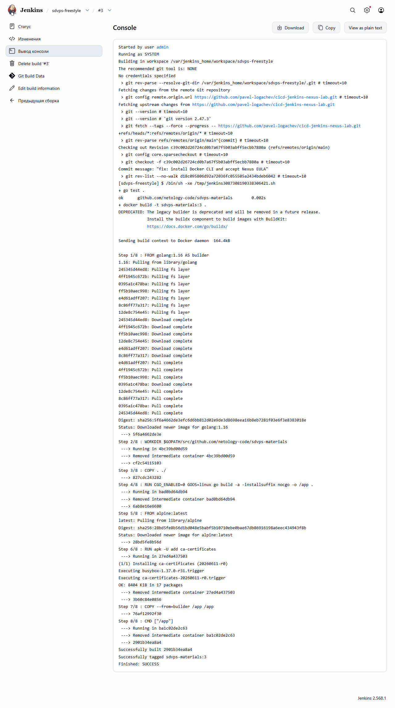
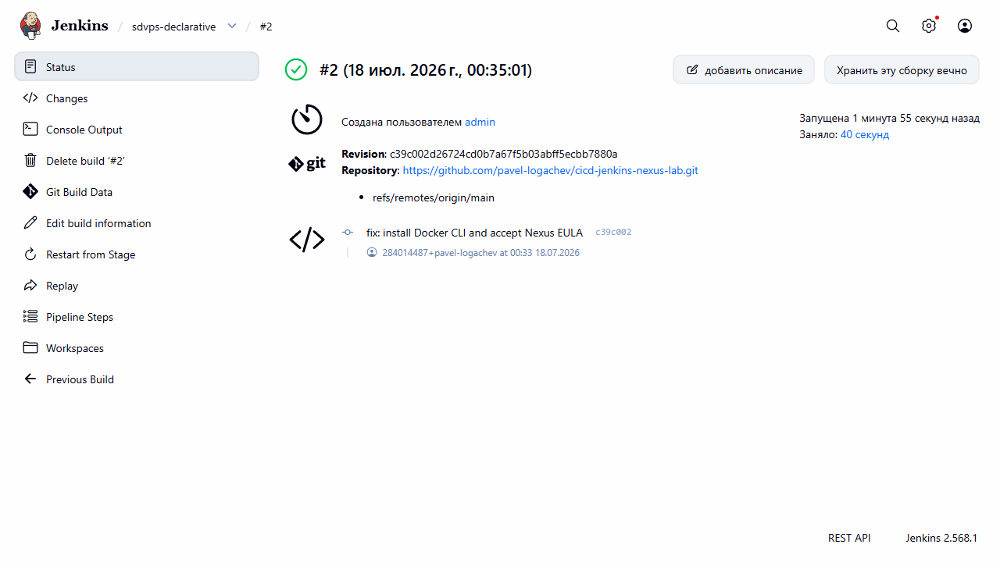
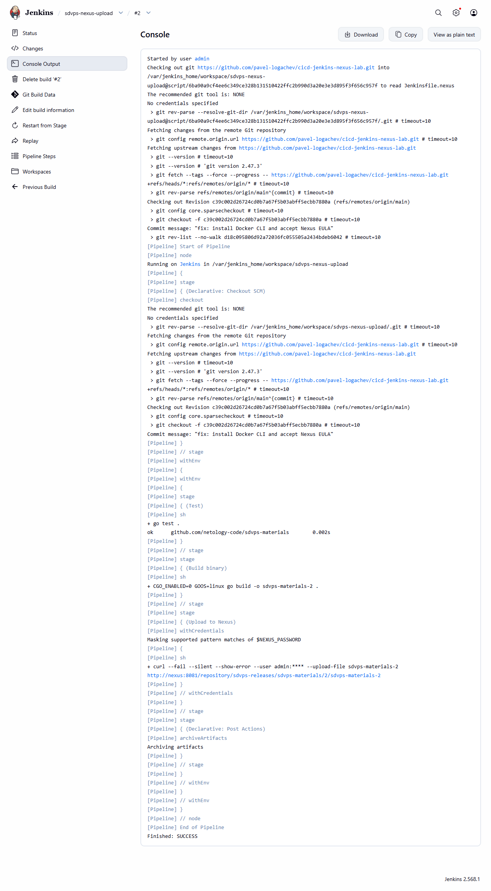
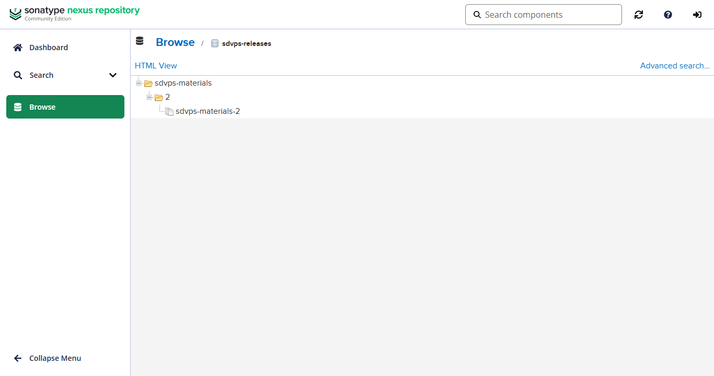
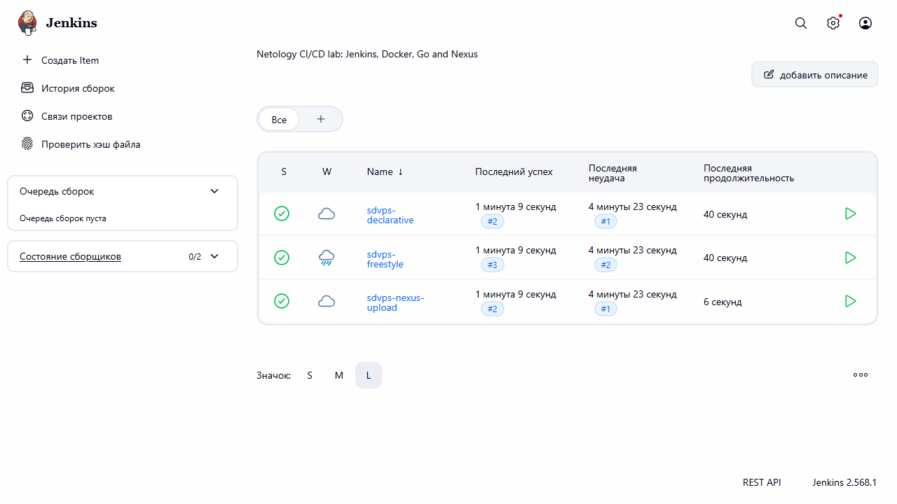

# Отчёт по практическому заданию «Что такое DevOps. CI/CD»

## Стенд

- исходный учебный репозиторий форкнут в `pavel-logachev/cicd-jenkins-nexus-lab`;
- Jenkins развёрнут локально в Docker и доступен на `http://localhost:8088`;
- Nexus Repository развёрнут локально в Docker и доступен на `http://localhost:8089`;
- Jenkins-агент содержит Go, Git, Docker CLI и плагины Pipeline/Job DSL/JCasC;
- конфигурация Jenkins и три задания создаются автоматически из `jenkins/casc.yaml`;
- учётные данные Nexus хранятся только в локальном `.env`, который исключён из Git.

## Задание 1. Freestyle

Job `sdvps-freestyle` клонирует публичный форк и выполняет:

```bash
go test .
docker build -t sdvps-materials:${BUILD_NUMBER} .
```

Результат: сборка `#3` завершена со статусом `SUCCESS`. В консоли подтверждены успешный `go test .`, сборка Docker-образа и тег `sdvps-materials:3`.



## Задание 2. Declarative Pipeline

Job `sdvps-declarative` использует `Jenkinsfile`. Отдельные стадии выполняют тест Go и сборку Docker-образа с номером сборки Jenkins.

Результат: сборка `#2` завершена со статусом `SUCCESS`. Обе стадии Declarative Pipeline успешно выполнены.



## Задание 3. Nexus

Одноразовый контейнер `nexus-bootstrap` создаёт raw-hosted репозиторий `sdvps-releases`. Job `sdvps-nexus-upload` использует `Jenkinsfile.nexus`, собирает версионированный бинарник и загружает его по пути:

```text
sdvps-materials/<BUILD_NUMBER>/sdvps-materials-<BUILD_NUMBER>
```

Результат: сборка `#2` завершена со статусом `SUCCESS`. Пароль скрыт Jenkins как `****`, бинарник загружен в Nexus и доступен в raw-репозитории.





## Итог

Все три Jenkins job зелёные и видны на общей панели:



Проверено дополнительно:

- Docker CLI `27.5.1` из Jenkins подключается к локальному Docker Engine `29.6.1`;
- Nexus Community Edition EULA принята через официальный REST API;
- raw-hosted `sdvps-releases` создан автоматически;
- REST API Nexus возвращает артефакт `/sdvps-materials/2/sdvps-materials-2`;
- реальные пароли не хранятся в Git и не отображаются в логах.

## Запуск

```bash
cp .env.example .env
docker compose up --build -d
```

После старта запустить три job из интерфейса Jenkins. Для остановки:

```bash
docker compose down
```
